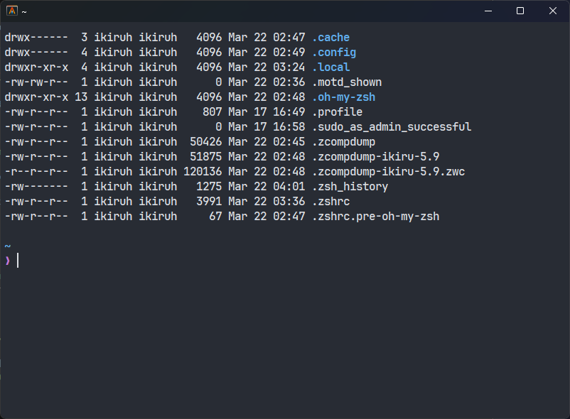

# Alacritty config

A beautifully designed Alacritty configuration for Windows 11 that allows you to open a WSL environment when you launch a terminal.

To make the config work, copy it to the appdata folder

```PowerShell
cd alacritty-conf
Copy-Item -Path "alacritty.toml" -Destination "$env:APPDATA\alacritty\"
```

